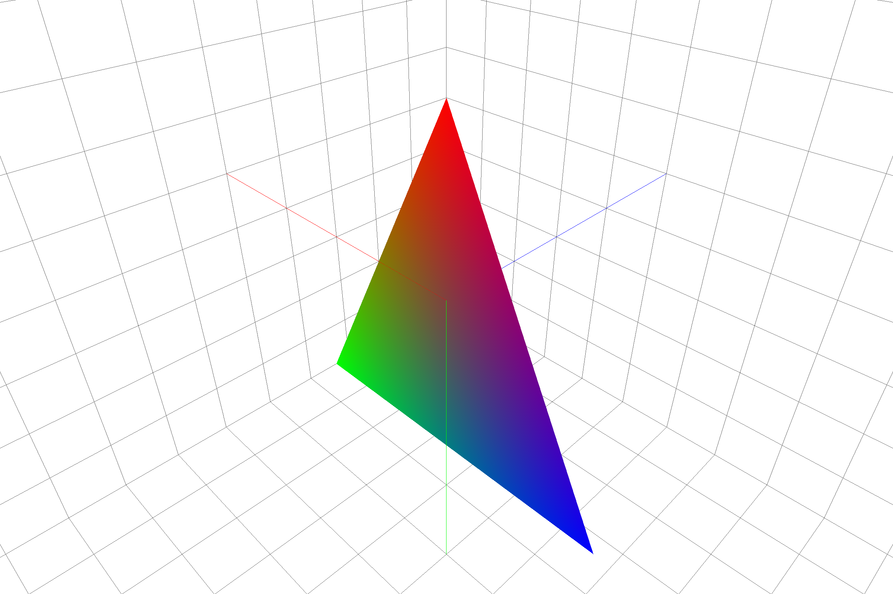
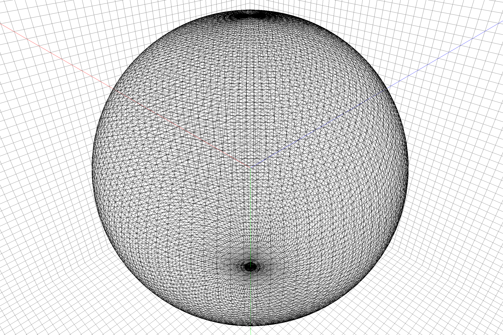

# glab: OpenGL Laboratory


# Usage
Build with:

```bash
$ make <math|physics|misc> no=<experiment number under each directory>
```

Each experiment number corresponds to the prefix of a file under `./lab/<genre>/`.
For example,

```bash
$ make physics no=08
```

and run produced `a.out` to see the result.

# Manual
Most of the experiments support the following user input.

| Input | Operation |
|:-----:|-----------|
| 🖱     | Look around |
| W     | Go forward |
| A     | Go left |
| S     | Go backward |
| D     | Go right |
| T     | Take a picture |
| P     | Switch projection matrices |
| 0️⃣-9️⃣   | Switch cameras |

# Experiments
## Math
| No | Category | Experiment |
|----|----------|------------|
| 01 | Geometry | Draw a single line.  |
| 02 | Geometry | Draw a triangle.  |
| 03 | Geometry | Draw a tetragon.  |
| 04 | Geometry | Draw a sphere.  |
| 10 | Geometry | Multiple rotations  |
